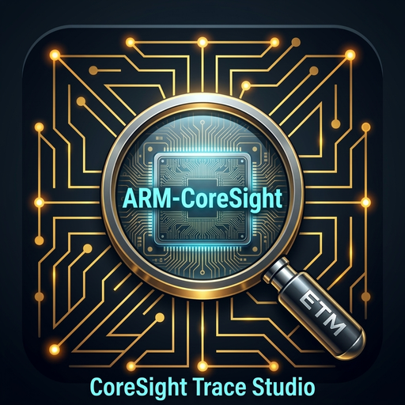

# CoreSight Trace Studio — VS Code IDE Extension

<p align="center">
  
</p>

## 1. Overview
**CoreSight Trace Studio** is a professional Visual Studio Code extension engineered to serve as an integrated GUI and workflow cockpit for embedded developers working with ARM CoreSight hardware-assisted trace (ETMv4).

It bridges firmware configuration, hardware pinout mapping, logic analyzer capture acquisition, Linaro OpenCSD trace decompression, and cycle-accurate execution reporting within a unified IDE interface.

---

## 2. Directory Structure
```
05_VSCode_Coresight_Trace_Studio_Extension/
├── src/                                  # TypeScript extension source code
│   ├── extension.ts                      # Activation & command registry
│   ├── codeInjector.ts                   # ETMv4.c automated driver synchronization
│   ├── snapshotGenerator.ts              # OpenCSD snapshot manifest builder
│   ├── traceDecoder.ts                   # High-speed parallel trace decoding engine
│   ├── reportGenerator.ts                # HTML & Markdown trace analytics engine
│   └── webview/                          # React/HTML/JS UI components for webview panels
├── templates/                            # Code generation templates for ETMv4 drivers
│   ├── ETMv4.c
│   └── ETMv4.h
├── out/                                  # Compiled JavaScript bundle
├── icon.png                              # Extension logo icon (512x512)
├── coresight-trace-studio-0.4.5.vsix     # Packaged VSIX extension installer (Latest v0.4.5)
├── coresight-trace-studio-0.4.4.vsix
├── coresight-trace-studio-0.4.3.vsix
├── coresight-trace-studio-0.4.2.vsix
├── coresight-trace-studio-0.3.0.vsix
├── coresight-trace-studio-0.2.0.vsix
├── coresight-trace-studio-0.1.0.vsix
├── package.json                          # Manifest, contributed commands, and configuration
├── tsconfig.json                         # TypeScript compiler settings
└── README.md
```

---

## 3. Core Feature Tabs

### Tab 1: Hardware Wizard & Pinout Guide
*   Interactive pinout and electrical wiring diagrams for the STM32H750 target.
*   Maps MCU pins (`PE2` - `PE6`) directly to the DreamSourceLab DSLogic U3Pro16 logic analyzer input channels.
*   Visualizes the CoreSight internal pipeline topology: Cortex-M7 Core -> ETMv4.1 -> CSTF (Trace Funnel) -> ETF (FIFO) -> TPIU -> Physical Pins.

### Tab 2: ETMv4 Configuration & Driver Generator
*   Visual bitfield configuration editor for CoreSight ETM registers:
    *   `TRCCONFIGR`: Instruction tracing, Cycle Accurate Tracing (CCI), Timestamping (TS), Branch Broadcasting (BB).
    *   `TRCSYNCPR`: Alignment synchronization frequency (with automated hardware detection guarding read-only silicon registers on Cortex-M7).
    *   `TRCCCCTLR`: Cycle count reporting threshold.
*   **One-Click Code Update**: Injects and updates configuration parameters directly into `ETMv4.c` in the active project workspace without manual copy-pasting.
*   **Silicon Protection**: Detects and enforces read-only register constraints (e.g., `TRCSYNCPR` fixed at 10 / 1024 bytes on STM32H7).

### Tab 3: Trace Decompression & Execution Analysis
*   Integrates with `TraceStreamProcessor.py` and Linaro OpenCSD.
*   Allows selecting a raw logic capture file (`.csv` / `.bin`) and automatically builds the OpenCSD snapshot.
*   Invokes `trc_pkt_lister` to stream disassembly to auto-numbered export files (`<snapshot>_decoded_<N>.ppl`).
*   **Cycle-Accurate Metric Extraction**: Parses canonical `OCSD_GEN_TRC_ELEM_CYCLE_COUNT` elements to prevent metadata double-counting, accurately verifying core clock frequency against hardware timestamps (e.g., 496,228 cycles in 496,222 µs = 1.000012 MHz).
*   **Instant Report Export**: One-click generation of concise, data-driven **HTML** and **Markdown** reports:
    *   Trace window duration ($\Delta\text{TS}$) and sync acquisition timestamps.
    *   Interrupt / Exception (IRQ) tracking: Pre-IRQ thread timestamp, Entry TS, Exit TS, ISR elapsed time ($\mu\text{s}$), and core execution cycles.
    *   Execution split: CPU percentage spent in ISRs vs. Main Thread.
    *   Code hotspots: Top executed address ranges and instruction shares.

---

## 4. Installation Instructions

### Option A: Install from VSIX via Command Line
Open a terminal in this directory and execute:
```bash
code --install-extension coresight-trace-studio-0.4.5.vsix --force
```

### Option B: Install from VSIX via VS Code UI
1.  Open Visual Studio Code.
2.  Navigate to the **Extensions** view (`Ctrl + Shift + X`).
3.  Click the **`...`** (Views and More Actions) menu in the top-right corner of the Extensions pane.
4.  Select **Install from VSIX...**.
5.  Choose `coresight-trace-studio-0.4.5.vsix`.

---

## 5. Development & Recompilation
To modify and build the extension from source:
```bash
npm install
npm run compile
npx @vscode/vsce package --no-dependencies
```
